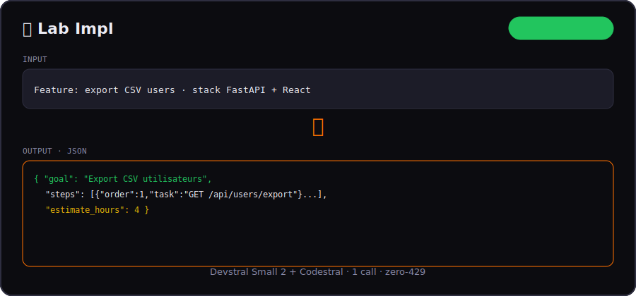
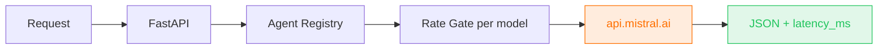

<div align="center">

# 🧪 Devstral Lab

**14 one-shot coding agents on [Mistral La Plateforme](https://docs.mistral.ai) — Devstral Small 2 + Codestral, zero-429 by design.**

[](LICENSE)
[](#-agent-catalog)
[](backend/)
[](frontend/)
[](https://console.mistral.ai)
[](backend/app/main.py)



*Code agentic · 1 task · 1 call · structured JSON · no LangChain loops.*

[Quick Start](#-quick-start) · [Example](#-example) · [Architecture](#-architecture) · [vs Copilot](#-why-devstral-lab) · [Bureau →](https://github.com/anthonyoccelli33480-ctrl/mistral-bureau)

</div>

---

## 📋 Example

**Agent:** `Lab Impl` (Devstral Small 2)

**Input**
```
Feature: export CSV des utilisateurs
Stack: FastAPI + React · auth JWT · PostgreSQL
```

**Output**
```json
{
  "goal": "Endpoint export CSV utilisateurs authentifié",
  "steps": [
    {"order": 1, "task": "Route GET /api/users/export", "test": "401 sans token"},
    {"order": 2, "task": "StreamingResponse CSV", "test": "headers Content-Disposition"}
  ],
  "estimate_hours": 4,
  "risks": ["Gros volumes → pagination stream"]
}
```

---

## 🎯 What is this?

**Devstral Lab** is Phase 1 of the Mistral showcase stack — a **code-only** vitrine for [Devstral](https://docs.mistral.ai/models/devstral-small-3-1-24b-instruct-25-10) and [Codestral](https://docs.mistral.ai/models/codestral).

| Model | Agents | Rate gate |
|-------|--------|-----------|
| **Devstral Small 2** (`devstral-small-latest`) | Review, Fix, Impl, Refactor, Test, Explain, Migrate, Secret | 30s |
| **Codestral** (`codestral-latest`) | Commit, Regex, SQL, Docker, OpenAPI, API Design | 20s |

> Phase 2 → **[Mistral Bureau](https://github.com/anthonyoccelli33480-ctrl/mistral-bureau)** (FR, Large, Pixtral vision)

## 📊 Benchmarks

| Metric | Devstral Lab | Multi-agent IDE loop |
|--------|--------------|----------------------|
| **Calls / task** | **1** | 5–30+ |
| **Output** | **JSON schema** | Markdown + tools |
| **Rate-safe** | Per-model gate | 429 spam |
| **Typical latency** | 2–6s | 15–120s |

Reproduce: `./scripts/benchmark.sh` (backend on `:8788` + `MISTRAL_API_KEY`)

## 🏗 Architecture



## 🚀 Quick Start

```bash
git clone https://github.com/anthonyoccelli33480-ctrl/devstral-lab.git
cd devstral-lab
cp .env.example .env   # MISTRAL_API_KEY from console.mistral.ai

make install
make backend   # http://127.0.0.1:8788
make frontend  # http://127.0.0.1:5175
```

macOS: double-click **`🧪 Lancer Devstral Lab.command`** on Desktop.

## 🤖 Agent Catalog

<details>
<summary><strong>Devstral (8)</strong> — agentic coding</summary>

| Agent | One-liner |
|-------|-----------|
| Lab Review | Diff → score + fixes |
| Lab Fix | Stack trace → patch |
| Lab Impl | Spec → implementation plan |
| Lab Refactor | Smell → clean code |
| Lab Explain | Code → explanation |
| Lab Test | Function → unit tests |
| Lab Migrate | Stack A → migration plan |
| Lab Secret | Leaked secrets scan |

</details>

<details>
<summary><strong>Codestral (6)</strong> — codegen</summary>

Lab Commit · Lab Regex · Lab SQL · Lab Docker · Lab OpenAPI · Lab API Design

</details>

Full list → [docs/AGENTS.md](docs/AGENTS.md)

## 🆚 Why Devstral Lab?

| | **Devstral Lab** | **Copilot Agent / Cursor** | **CrewAI** |
|--|------------------|---------------------------|------------|
| Scope | One-shot JSON task | Multi-file agent loop | Autonomous crew |
| Models | **Devstral + Codestral** | Mixed | Any provider |
| 429-safe | **Built-in gates** | Opaque | Your problem |
| Best for | **Precise dev tasks** | IDE integration | Long workflows |

Complements **[Flash Agents](https://github.com/anthonyoccelli33480-ctrl/flash-agents)** (Cerebras speed) and **[Mistral Bureau](https://github.com/anthonyoccelli33480-ctrl/mistral-bureau)** (FR product).

## 🔑 Keywords

`devstral` · `codestral` · `mistral-ai` · `code-agentic` · `llm-agents` · `fastapi` · `structured-output` · `zero-429` · `developer-tools`

## 📜 License

MIT — [LICENSE](LICENSE)

---

<div align="center">

**⭐ Phase 1 of the Mistral showcase — Bureau is Phase 2.**

Built to show what **Devstral** feels like without framework tax.

</div>